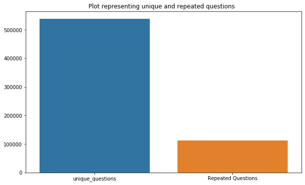

# Quora-Question-Pair
https://www.kaggle.com/khushboo88/question-pair-solution/
#### **In order to build a high-quality knowledge base, it's important that we ensure each unique question exists on Quora only once. Writers shouldn't have to write the same answer to multiple versions of the same question, and readers should be able to find a single canonical page with the question they're looking for. For example, we'd consider questions like “What are the best ways to travel in india?”, “How can a person travel around in india?”, and “What are effective transportation available in india?” to be duplicate questions because they all have the same intent. To prevent duplicate questions from existing on Quora, we've developed machine learning and natural language processing systems to automatically identify when questions with the same intent have been asked multiple times.** 

## Problem Statement __

Identify which questions asked on Quora are duplicates of questions that have already been asked. This could be useful to instantly provide answers to questions that have already been answered. We are tasked with predicting whether a pair of questions are duplicates or not.

## Reading data and basic stats
Aim To Build high quality Knowledge base
 
Task To ensure that every unique question exist in quora only once and  
if there exist multiple version of question 
writter should not write same answer and 
reader must see same canonical page to the question 
Latency time is concern (question must be answer in less time)
cost of miss classification at any cost (TARGET FINNALLY)

STEP performed : Reading the Dataset and basic stats Split it into train
 and test data 
we have 5 column {qid1 ,qid2 ,Question 1 and question 2 ,Is duplicate}
{qid1 ,qid2 ,Question 1 and question 2 <----Xi
is duplicate is <----Yi

STEP 2 perform EDA - Exploratory Data Analysis

Q1 and Q2 --> IDENTIFY THE NUMBER OF UNIQUE QUESTIONS -so we find Unique question appearing more than once (That me uniques question exisyt)Q1 Q2 Q3 Q4

  Max  number of times a questiion is repeated   q3 =167
Check that Number of duplicate records are there like q1 and q3 pair is only once
Number of occurence of each question 

 BASIC FEATURE ENGINEERING 
frquency of q1 ,frequency of q2
question lenght of q1 and q2
number of words in q1 and q2 
word common in both q1 and q2
word total = total no of word in q1 + total no of words in q2 
word share = Word common / word total
freq q1 +freq q2
frq q1 -freq q2

STEP 3 PREPROCESSING OF TEXT
Removing html tags
Removing Punctuations
Performing stemming
Removing Stopwords & replacing shortcut with appropripate word
Expanding contractions etc
isduplicate 

ADVANCE FEATURE EXTRACTION
now based on words

cwc min = Ratio of common word count / min (len (Word in q1 ), len(word in q2))
cwc max = Ratio of common word count / max (len (Word in q1 ), len(word in q2))

now based on stop words 

csc min = Ratio of common stopword count / min (len ( stop in q1 ), len(stop  in q2))
csc max = Ratio of common stopword count / max (len (stop  in q1 ), len(stop  in q2))

now based on tokens

ctc min = Ratio of common Token count / min (len ( token in q1 ), len(token  in q2))
ctc max = Ratio of common token count / max (len (token  in q1 ), len(token  in q2))

Last word equal : last word is same or not

first word equal: first word is same or not 

absolute lenght difference : ABS(len of q1 token - lenght of q2 token)

mean lenght=(len of q1 token) +( lenght of q2 token)/2

Fuzzy ratio: If edit distance is very less then word are highly similar fuzzy wuzzy [0 to 100] 100 is very similar eg.FUZZ (NEWYORK ,NEWYANK)=75

fuzz partial:  if partially match the string best NEW York & NEW  YANK  partial match is 50%
token sort :  SORT THE TOKEN  :- EG.  India is incredible ,incredible india      ----> is similar 
token set ratio: S1 and S2 string  

T0 is  Interesection of S1 and S2 
T1 is  intersection  +  token in S1 
T2 is  intersection  +  token in S2

Combination of T0 ,T1
Combination of T1 ,T2
Combination of T2 ,T0

longest common substring
substring :- C1 C2 C3 C4 C5 
Sentence 2 :- C6 C2 C3 C4 C5 
longest common substring :C2 C3 C4 C5 
lenght =4 divide by Min (len token q1),len(token q2)

Using TSNE for Visualization  Dimensionality reduction of 15 features to 3 dimension 
TSNE to project this data in 2D datasset and Dimensional reduction 

Once the feature are reduced in to feature set to be applied to ML model 
 me Load the data in the ML like Random forest XGBOOST etc

END
 
